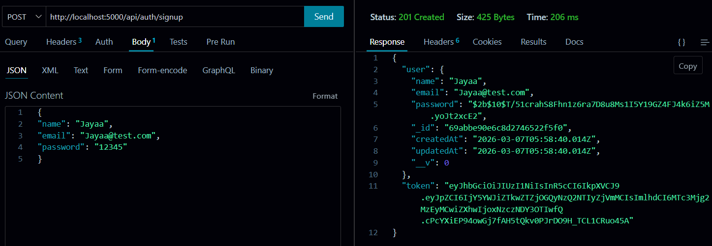
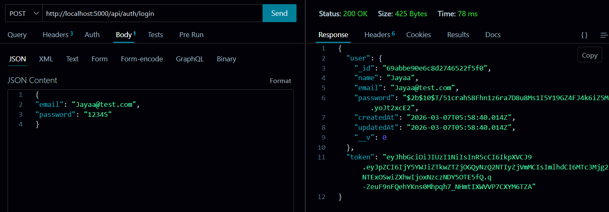
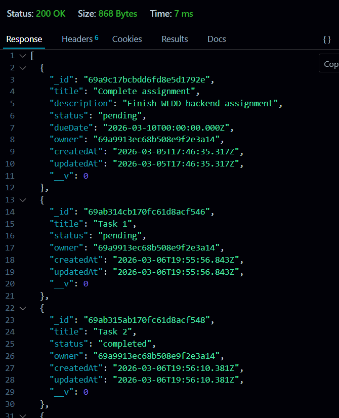
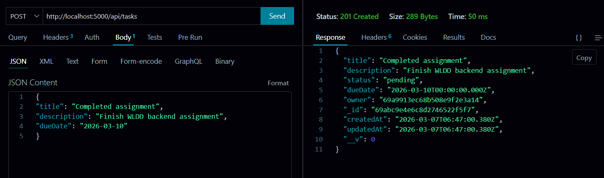
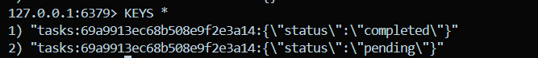
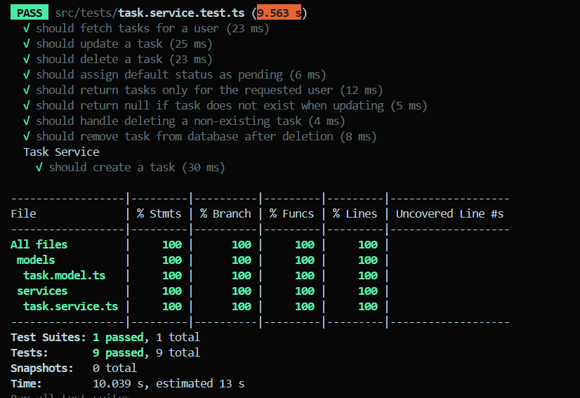

# 📝 Task Tracker API


A robust backend service for managing personal tasks, featuring secure authentication, high-performance caching, and full CRUD capabilities. Built as part of a **Backend Developer Assignment**.

---

## 🚀 Overview
The **Task Tracker API** allows authenticated users to manage their daily workflows with high efficiency. It demonstrates key backend engineering concepts such as:

* **REST API Design**: Clean and predictable resource-based endpoints.
* **Security**: User authentication via **JWT** and password hashing with **bcrypt**.
* **Performance**: **Redis** caching strategy to reduce database load.
* **Reliability**: 100% unit test coverage using **Jest**.

---

## 🛠 Tech Stack

| Technology | Purpose |
| :--- | :--- |
| **Node.js** | Backend runtime |
| **Express.js** | REST API framework |
| **TypeScript** | Type-safe development |
| **MongoDB** | Primary NoSQL database |
| **Mongoose** | MongoDB ODM |
| **Redis** | Caching layer for performance |
| **JWT** | Secure authentication tokens |
| **Jest** | Unit testing framework |
| **In-Memory Mongo**| Isolated database for testing |

---

## 🏗 System Architecture

The system follows the **Cache-Aside Pattern**:
1.  **Check Redis**: Look for data in the cache first.
2.  **Database Fallback**: If cache miss → fetch from MongoDB.
3.  **Cache Update**: Store the result in Redis for future requests.
4.  **Invalidation**: Cache is cleared when tasks are created, updated, or deleted to maintain consistency.


The system follows the **Cache-Aside Pattern**:

1. Check Redis cache  
2. If cache miss → fetch from MongoDB  
3. Store result in Redis  
4. Return response  

Cache is invalidated when tasks are:

- created
- updated
- deleted

---

## 📂 Project Structure

```text
task-tracker-api
│
├── src
│   ├── config          # DB and Redis connection logic
│   ├── controllers     # Request/Response handling
│   ├── middleware      # Auth guards (JWT)
│   ├── models          # Mongoose Schemas (User, Task)
│   ├── routes          # API Route definitions
│   ├── services        # Core business & caching logic
│   ├── tests           # Jest unit tests
│   └── app.ts          # Express application entry
│
├── .env.example        # Environment variables template
├── jest.config.js      # Testing configuration
├── tsconfig.json       # TypeScript configuration
└── README.md
```

---

## Quick Start

Clone the repository and start the server:

```bash
git clone <repository-url>
cd task-tracker-api
npm install
npm run dev
```


## Setup Instructions

### 1. Install dependencies
npm install

### 2. Configure environment variables
Create a `.env` file using `.env.example`.

Example:
```
PORT=5000
MONGO_URI=mongodb://localhost:27017/tasktracker
JWT_SECRET=your_secret_key
REDIS_URL=redis://localhost:6379
```

### 3. Start MongoDB
mongod

### 4. Start Redis
redis-server

### 5. Run the Server
npm run dev

### Server will start at:
`http://localhost:5000`

--- 

## Authentication API's

### Signup



`POST /api/auth/signup`

Request
```
{
  "name": "Kushagra",
  "email": "user@example.com",
  "password": "password123"
}
```

### Login



`POST /api/auth/login`

Response
```
{
  "user": {...},
  "token": "JWT_TOKEN"
}
```

Use the token in request headers:
`Authorization: Bearer <token>`

---

## Task APIs

All task APIs require **JWT authentication**.

### Get Tasks



`GET /api/tasks`

Returns all tasks for the logged-in user.
This endpoint uses **Redis caching**.

### Create Tasks



`POST /api/tasks`

Example Request:
```
{
  "title": "Complete assignment",
  "description": "Finish backend assignment",
  "dueDate": "2026-03-10"
}
```

### Update Tasks
`PUT /api/tasks/:id`

Example:
```
{
  "status": "completed"
}
```

### Delete Task
`DELETE /api/tasks/:id`

Response:
Task Deleted 

---

## Task Filtering (Bonus Feature)

Tasks can be filtered using query parameters.

Examples:
```
GET /api/tasks?status=pending
GET /api/tasks?status=completed
GET /api/tasks?dueDate=2026-03-10
```

Filtering works together with Redis caching using filter-aware cache keys.

Example Redis keys:
```
tasks:<userId>:{"status":"pending"}
tasks:<userId>:{"status":"completed"}
```

This ensures correct caching for filtered queries.

---

## Redis Caching Strategy



The system caches task lists per user using Redis.

Cache key format:
`tasks:<userId>`

For filtered queries:
`tasks:<userId>:<filters>`

Cache is invalidated whenever:

- a task is created
- a task is updated
- a task is deleted

This ensures fast reads and consistent data.

---

## Testing



Tests are implemented using Jest with mongodb-memory-server to simulate MongoDB during testing.

Run tests:
`npm test`

Generate coverage report:
`npm run test:coverage`

Current coverage:
```Statements: 100%
Branches: 100%
Functions: 100%
Lines: 100%
```

---

## Security Features

- Password hashing using bcrypt
- Authentication via JWT
- Protected routes using middleware
- Environment variables for sensitive data

---

## Future Improvements

- Pagination for large task lists
- Rate limiting
- Role-based access control
- Dockerized deployment

---

## Author

Kushagra Bhargava | Backend Developer